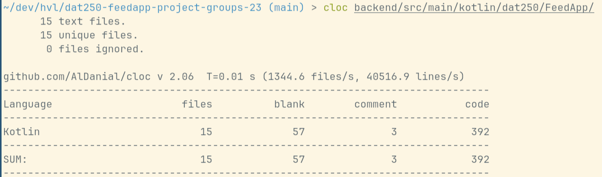

# DAT250 FeedApp Project Group 23

## Comparison

This purpose of this branch is a comparison of using Kotlin vs. Java for
developing Spring applications. For this the existing Kotlin code 
was translated into Java code. 

A detailed analysis of the results will be found in the final report. 

### Lines of code

