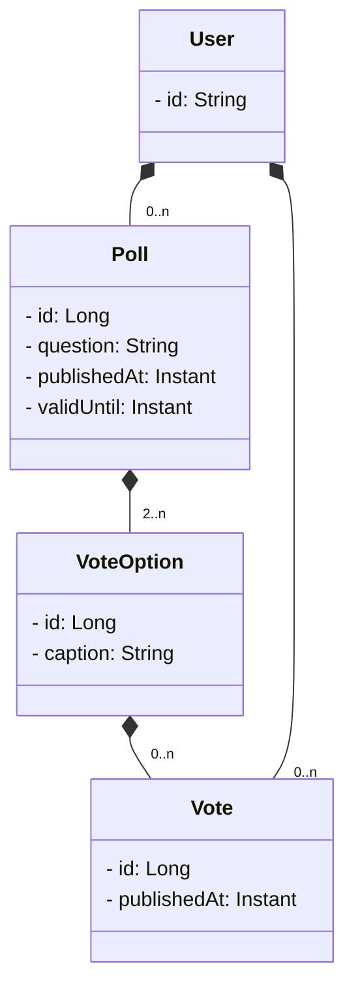

# DAT250 FeedApp Project Group 23

## PLAN
### Backend
1. domain model
2. rest api
3. security

4. jpa / h2
5. cache
6. messaging

### Frontend
1. ui
2. login
3. auth

### Containerization
- Frontend
- Backend
- Compose

## Diagrams

### Domain model



### Running the project
#### Create `.env` file:
```bash
# example .env
OAUTH_CLIENT_ID=your_client_id
OAUTH_CLIENT_SECRET=your_client_secret
SPRING_REDIS_HOST=redis
SPRING_REDIS_PORT=6379
SPRING_RABBITMQ_HOST=rabbitmq
SPRING_RABBITMQ_PORT=5672
```

#### Docker
1. Build and copy the frontend  
From the project root, run:
```bash
./gradlew :frontend:copyWebApp
```
2. Build image:  
```bash
docker build -t feedapp .
```
3 Run image:  
```bash
docker run --rm --env-file .env -p 8080:8080 feedapp
```

#### Running using compose:
- Run:  
```bash
docker compose up --build
```
- Stop:  
```bash
docker compose down
```   
- Stop and delete all data:  
```bash
docker compose down -v
```

### RabbitMQ messaging
- `feedapp.events` topic exchange is created automatically with durable queues `feedapp.poll.created.queue` and `feedapp.vote.cast.queue`.
- When a poll is created the backend emits a `PollCreatedEvent` (routing key `poll.created`); casting a vote emits a `VoteCastEvent` (`vote.cast`).
- Both queues are consumed by the backend so the events become visible in the logs without additional services, and other services can bind to the same exchange to react to changes.
- Override queue/exchange names through the `feedapp.messaging.*` properties or the corresponding environment variables in `application.yml`.

### Redis caching
- Poll vote listings (`pollVotes` cache) and vote option counts (`pollVoteCounts`) are cached in Redis for the duration configured by `feedapp.cache.ttl` (default 60 seconds).
- Casting or deleting votes/polls automatically invalidates the relevant cache entries to keep data fresh.
- Redis host/port values are picked up from `.env` (`SPRING_REDIS_HOST`, `SPRING_REDIS_PORT`), matching the docker-compose setup.

### Frontend usage
- The Svelte SPA is served by the Spring Boot backend once you run `./gradlew :frontend:copyWebApp` followed by `docker compose up --build` (or `./gradlew bootRun` for local dev).
- Navigate to `http://localhost:8080/oauth2/authorization/github` to sign in; after the callback the SPA automatically detects the authenticated user via `/api/v1/user`.
- Creating polls and casting votes now call `/api/v1/polls` and `/api/v1/votes` respectively, so every action is reflected immediately in the backend (and the RabbitMQ/Redis integrations).


# DAT-250 Project Progess Presentation - Group 23
### Tech stack
- Backend:
    - Spring Boot  
        - with Kotlin <- feature technology    
        - github Oauth for security  
        - RabbitMQ events for poll/vote lifecycle  
        - Redis caching for poll results  
- Frontend:
    - svelte SPA wired to the Spring API (`/api/v1/**`)
- CI/CD
    - Docker  
        - compose for gralde+redis+rabbitmq  
        - image pushed on docker hub  
        - github-actions  

### Potential Hypotheses for technology assesment
- (Productivity): Kotlin reduces source-code size and accelerates implementation of domain logic compared with Java. Also discuss kotlin integration in other IDEs than IntelliJ
- (Safety): Kotlin’s type system decreases the incidence of runtime null-pointer exceptions.
- (Readability and Maintainability): Developers perceive Kotlin code as more readable and easier to maintain.
- (Performance Cost): Kotlin compilation or runtime overhead does not significantly degrade build or execution times relative to Java.
