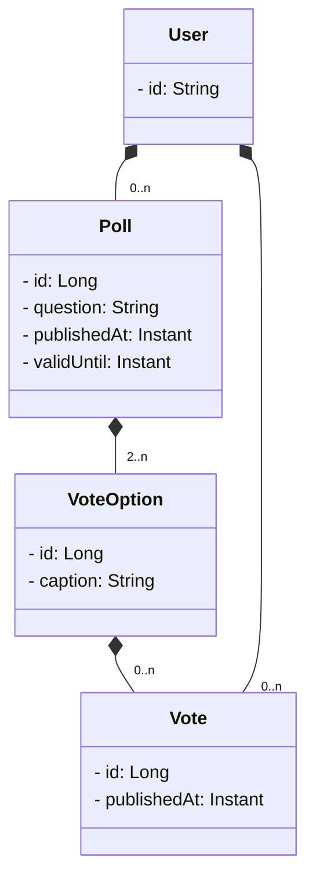

# DAT250 FeedApp Project Group 23

## PLAN
### Backend
1. domain model
2. rest api
3. security

4. jpa / h2
5. cache
6. messaging

### Frontend
1. ui
2. login
3. auth

### Containerization
- Frontend
- Backend
- Compose

## Diagrams

### Domain model



### Running the project
#### Create `.env` file:
```bash
# example .env
GITHUB_OAUTH_CLIENT_ID=your_client_id
GITHUB_OAUTH_CLIENT_SECRET=your_client_secret
SPRING_REDIS_HOST=redis
SPRING_REDIS_PORT=6379
SPRING_RABBITMQ_HOST=rabbitmq
SPRING_RABBITMQ_PORT=5672
```

#### Docker
1. Build and copy the frontend  
From the project root, run:
```bash
./gradlew :frontend:copyWebApp
```
2. Build image:  
```bash
docker build -t feedapp .
```
3 Run image:  
```bash
docker run --rm --env-file .env -p 8080:8080 feedapp
```

#### Running using compose:
- Run:  
```bash
docker compose up --build
```
- Stop:  
```bash
docker compose down
```   
- Stop and delete all data:  
```bash
docker compose down -v
```


# DAT-250 Project Progess Presentation - Group 23
### Tech stack
- Backend:
    - Spring Boot  
        - with Kotlin <- feature technology    
        - github Oauth for security  
        - RabbitMQ (not yet implemented)  
        - Redis (not yet implemented)  
- Frontend:
    - svelte
    - not connected yet
- CI/CD
    - Docker  
        - compose for gralde+redis+rabbitmq  
        - image pushed on docker hub  
        - github-actions  

### Potential Hypotheses for technology assesment
- (Productivity): Kotlin reduces source-code size and accelerates implementation of domain logic compared with Java. Also discuss kotlin integration in other IDEs than IntelliJ
- (Safety): Kotlin’s type system decreases the incidence of runtime null-pointer exceptions.
- (Readability and Maintainability): Developers perceive Kotlin code as more readable and easier to maintain.
- (Performance Cost): Kotlin compilation or runtime overhead does not significantly degrade build or execution times relative to Java.