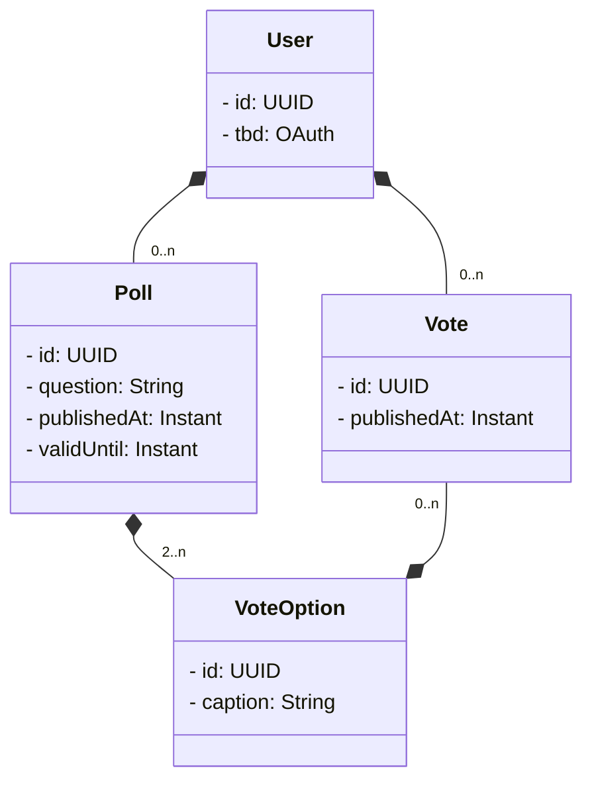

# DAT250 FeedApp Project Group 23

## PLAN
### Backend
1. domain model
2. rest api
3. security

4. jpa / h2
5. cache
6. messaging

### Frontend
1. ui
2. login
3. auth

### Containerization
- Frontend
- Backend
- Compose

## Diagrams

### Domain model

